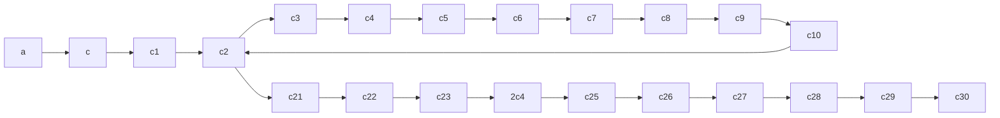
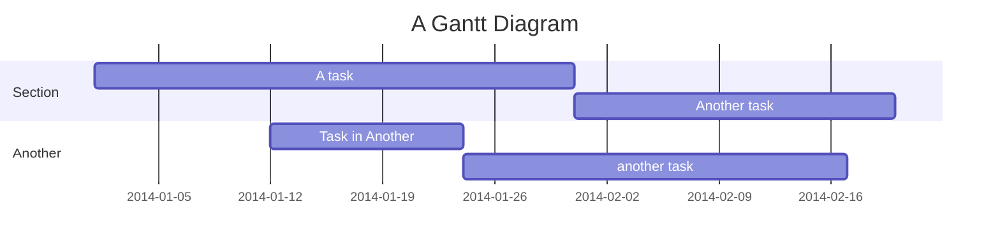

```mermaid
flowchart LR
a-->c-->c1-->c2-->c3-->c4-->c5-->c6-->c7-->c8-->c9-->c10-->c2-->c21-->c22-->c23-->2c4-->c25-->c26-->c27-->c28-->c29-->c30
```

```markmap
---
markmap:
  height: 200
---
## Root
### Branch1
#### Branch11
#### Branch12
### Branch2

## gg
### g1
### g2
```



```mermaid
gantt
	title A Gantt Diagram
	dateFormat YYYY-MM-DD

	section Section
		A task :a1, 2014-01-01, 30d
		Another task :after a1, 20d

	section Another
		Task in Another :2014-01-12, 12d
		another task :24d
```